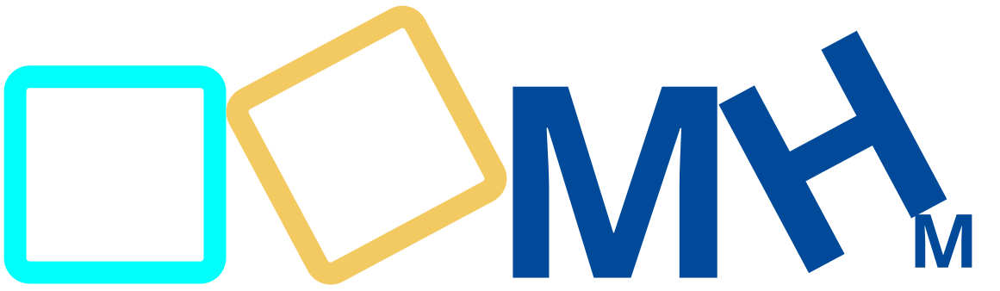

  
  

  <h1>¡Te doy la bienvenida a mi perfil de GitHub <strong>@marchernandezmo!</strong> 👋</h1>
  
<strong>Aquí tienes algunos enlaces que te pueden servir: </strong>

  
  

  <table>
    <tr>
      <td>
        
      </td>
      <td>
        
      </td>
      <td>
        
      </td>
    </tr>
    <tr>
      <td>
        
      </td>
      <td>
        
      </td>
      <td>
        
      </td>
    </tr>
  </table>
  

   

  <!-- GitHub Sponsors -->
  

    

  <em>Estamos a una línea de código de conseguir algo increíble. El único límite es nuestra imaginación.</em>

